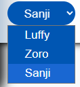

> # OnePiece Fan Website
> A One Piece fan **Website**. This website doesn't fall in **piracy** catrgories.

## Technology used:
- HTML - Basic Website **Structure**
- CSS - **Styling** and cascading
- JS - Make website **function**able

## Features:
- **Light/Dark** mode,
- Multiple Pages

## Overview
- Different Themes (Luffy/ Zoro/ Sanji)

</img>

- Luffy Theme

</img>

- Zoro Theme

</img>

- Sanji Theme

</img>

- First bounty of All characters

</img>

